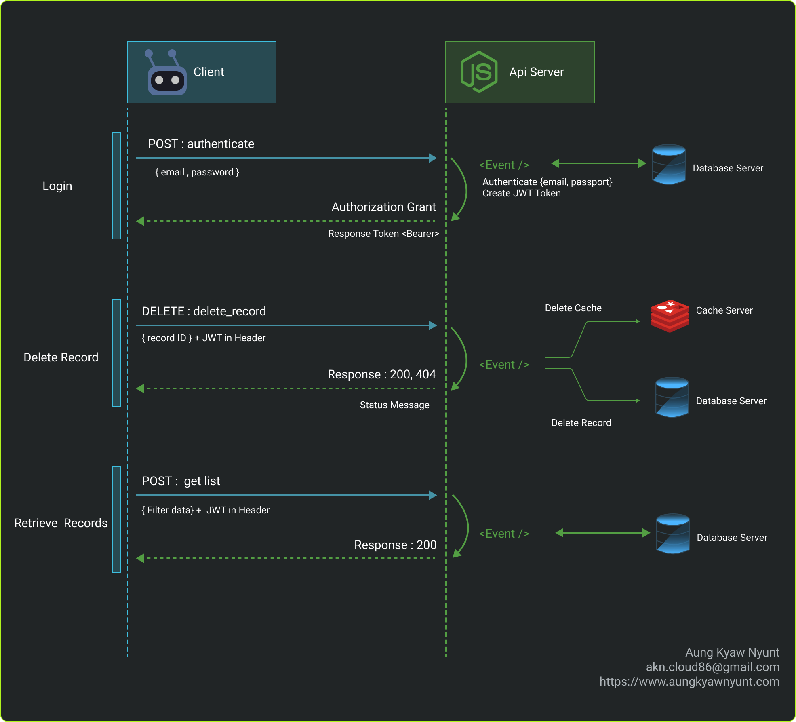

# URL Shortener Service
[](https://github.com/helloakn/url-shortener-service) [](https://github.com/helloakn/url-shortener-service) [](https://github.com/helloakn/url-shortener-service) 

[](https://github.com/helloakn/url-shortener-service) 
[](https://github.com/helloakn/url-shortener-service) 
## Table of content
- [1] Application Description
- [2] Application Functionalities
- [3] Git Conventional Commits Message
- [4] Flow Diagram
- [5] File Structure
- How To Run
- Acknowledgments
---

### [1] Application Description
URL-shortener service to shorten URLs.  
API clients will be able to create short URLs from a full length URL.  
It will also support redirecting the short urls to the correct url.

### [2] Application Functionalities

<details>
 <summary>[2.1] Url Shortening</summary>
 
- An API Client can send a url and be returned a shortened URL. 
- An API Client can specify an expiration time for URLs when creating shortened URL 
- Handle visits to Shortened URLs, they must redirect to the original URL with a HTTP 
302 redirect, 404 if not found. 
- Visiting expired URLs must return HTTP 410 
- Input URL should be validated and respond with error if not a valid URL 
- Regex based blacklist for URLs, urls that match the blacklist respond with an error 
- Hit counter for shortened URLs (increment with every hit) 
</details>
<details>
<summary> [2.2] Admin API</summary> 

- Admin api (requiring token) to list 
  - Short Code 
  - Full Url 
  - Expiry (if any) 
  - Number of hits 
- Above list can filter by Short Code and keyword on origin url. 
- Admin api to delete a URL (after deletion shortened URLs must return HTTP 410 on visit) 
</details>

### [3] Git Conventional Commits Message
<pre>
<b><a href="#body">[Type] : Message</a></b>
<sub>Type =>  [Create], [Modify], [Fix], [Delete]</sub>
<sub>Message =>  Describe about the commit</sub>

<b><a href="#body">Example</a></b>
<sub>[Create] message event for bla bla bla</sub>
<sub>[Modify] message event for bla bla bla</sub>
<sub>[Fix] message event for bla bla bla</sub>
</pre>

### [4] Flow Diagram

#### [4.1] Chache Layer Flow


#### [4.2] Admin API Flow



### [5] File Structure
```
-api
├── src                               # for typescripts
│   ├── app                           # 
│   │   ├── controllers
│   │   ├── middlewares
│   │   ├── routes
│   │   ├── controllers
│   ├── core                          # 
│   │   ├── common
│   │   │    └── interfacesNtypes  
│   │   ├── functions
│   │   ├── databases
│   │   ├── http

```
### How To Run
#### configuration
<details>
<summary> .env</summary> 

```
REST_SERVER_HOST=localhost
REST_SERVER_PORT=9090

DB_SERVER_HOST=localhost
DB_SERVER_PORT=3306
DB_SERVER_USR=username
DB_SERVER_PASSWD=password
DB_SERVER_DB_NAME=databasename

REDIS_SERVER_HOST=redis-host
REDIS_SERVER_PORT=redis-port
REDIS_SERVER_USER=user
REDIS_SERVER_PWD=password
```
</details>

---

##### create cache image
```
docker build -t urlshortener:cachelayer \
  --no-cache -f ./docker/cacheDockerfile .
```
##### run cache image
```
docker run -i -t -d --name cachelayer001 \
-p 3333:6379 \
--privileged urlshortener:cachelayer
```

### How to Test
This test support only for "local machine without docker"  
<details>
 <summary> Unit Test</summary>
 
 command
 ```
 cd api
 npm run test:unit
 ```
 Screen Shoot
 
</details>

<details>
 <summary> Integration Test</summary>
 
 command
 ```
 cd api
 npm run test:e2e
 ```
 Screen Shoot
 
</details>

<details>
 <summary> Test all in once</summary>
 
 command
 ```
 cd api
 npm run test
 ```
 Screen Shoot
 
</details>

#### OpenApi
Pls let me assume our api is http://localhost:9090 .
So, our swagger url will be http://localhost:9090/swagger/


### Acknowledgments
Thank you so much.


docker run -i -t -d --name cachelayer001 \
--privileged urlshortener:cachelayer